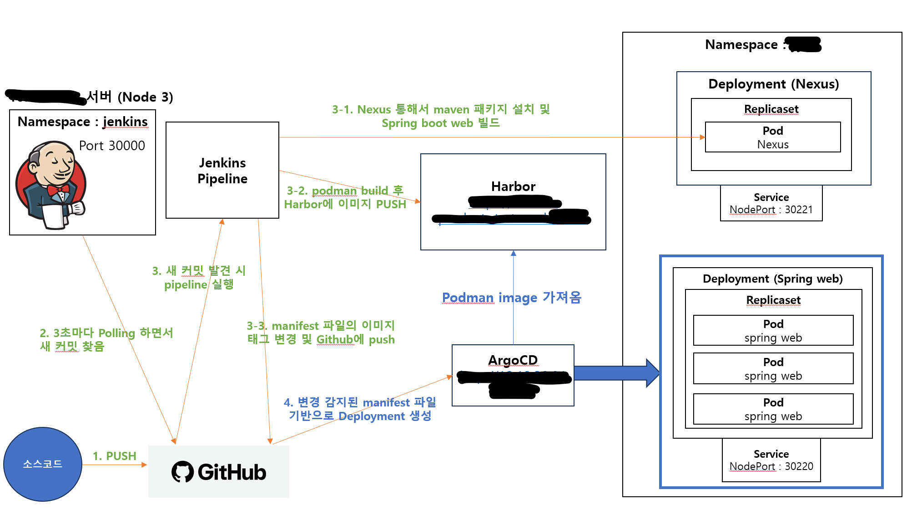

## [Jenkins + Nexus + Podman + Harbor + ArgoCD + k8s]

###  Jenkins 파이프라인과 Nexus, Podman, Harbor, ArgoCD, k8s를 이용한 Spring Boot 웹서버 CICD 구조도입니다.
- k8s/deployment.yaml을 이용한 k8s 배포
- Git webhook이 아닌 Jenkins Polling 기능을 통한 새 커밋 감지
- Spring 앱 빌드에 필요한 패키지들을 Nexus를 통해 설치
- Podman을 이용한 이미지 빌드 후 Docker hub 대신 Harbor에 저장
- sed 명령어로 manifest 파일의 이미지 태그 부분을 수정하여 git push
- Argo CD가 manifest 파일의 변화를 감지하여 Deployment 생성

